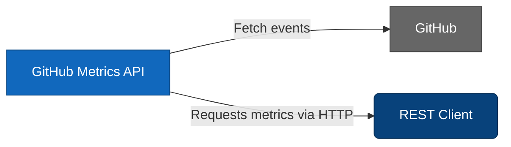
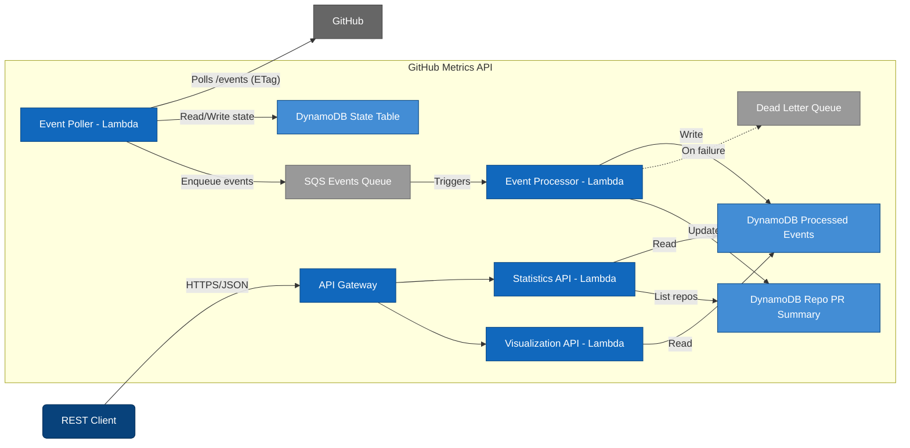
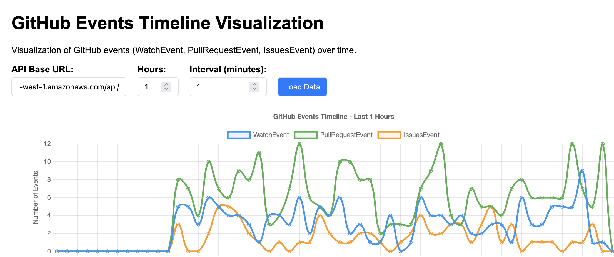

# Github-metrics-api

# Metrics API for GitHub Events

Serverless application that collects public GitHub events (https://api.github.com/events) and provides metric through a REST API for selected event types. Built with AWS SAM, the system tracks selected events and PR activities, saves them to a DynamoDB and provides API endpoints via Lambda->API Gateway to calculate event and repository metrics.

### Design decisions
- **GitHub event API**: 
  - API enforces rate-limiting (60req/minute unauthenticated or up to 5000 with Github token)
  - Supports x-poll-interval for efficient polling and ETag
  - Low event volumes (< 1000/min)

- **Architecture**: 
  - AWS, using SAM
  - Serverless: Simple, cost-effective, no infrastructure management needed for this use case
     - Uses event polling and processing via Lambda with SQS decoupling for event processing. Polling uses DynamodDB as state storage to lookup the last Etag 
     - Events are stored in DynamoDB with schema designed for specific metrics
     - Endpoints are published through API Gateway

-  **Runtime costs**: Should be safely within AWS Free Tier limits 

## Architecture

---


## Components

### 1. **EventPoller Lambda**
- **Purpose**: Polls GitHub Events API
  - ETag-based caching to minimize API calls
  - Rate limiting awareness
  - Filters for WatchEvent, PullRequestEvent, IssuesEvent
  - Publishes events to SQS for processing

### 2. **EventProcessor Lambda**  
- **Purpose**: Processes GitHub events from SQS and stores them to DynamoDB table
- **Features**:
  - SQS-triggered processing
  - Minimal data storage for efficient queries
  - Type-specific event handling
  - Dead letter queue for failed processing

### 3. **StatisticsAPI Lambda**
- **Purpose**: REST API for GitHub metric
- **Endpoints**:
  - `GET /metrics/pr-average?repo=owner/repo` - Calculate average time between PRs
  - `GET /metrics/events/count?offset=10` - Count events by type

### 4. **VisualizationAPI Lambda**
- **Purpose**: Populate a line graph of the tracked event types in time
- **Endpoints**:
-  `GET  /visualization/timeline?hours=1&interval=1`

### 5. **DynamoDB Tables**
- **StateTable**: Stores poller state (ETag, last event ID)
- **ProcessedEventsTable**: Optimized event storage with GSI for efficient queries
- **RepoPRSummary**: Helper table that stores repository name with >1 PR, to provide user with list of options when querying for PR average time.

### 6. **SQS Queue**
- **EventsQueue**: Decouples event polling from processing
- **DeadLetterQueue**: Handles failed event processing

## Usage

#### Calculate PR Average Time

```http
GET /metrics/pr-average?repo=owner/repository
GET /metrics/pr-average
```
**Parameters:**
- `repo`: String: Repository name to check. Calling the endpoint without the parameter returns list of already logged repos with 2 or more PRs

- It needs a bit of time (~10 minutes) to populate before there are meaningful data


**Example Response:**
```json
{
  "repository": "microsoft/vscode",
  "pr_count": 26,
  "average_time_between_pr": 563.5,
  "first_pr_date": "2024-12-01T10:30:00Z",
  "last_pr_date": "2024-12-15T14:22:00Z"
}

{
  {"repositories": ["microsoft/vscode", "owner/repo"]}
}
```

#### Count Events by Type
```http
GET /metrics/events/count?offset=60
```

**Parameters:**
- `offset`: Minutes to look back (default: 10)

**Example Response:**
```json
{
  "time_range": {
    "start_time": "2024-12-15T13:22:00Z",
    "end_time": "2024-12-15T14:22:00Z", 
    "offset_minutes": 60
  },
  "event_counts": {
    "WatchEvent": 1247,
    "PullRequestEvent": 89,
    "IssuesEvent": 156
  },
  "total_events": 1492
}
```

#### Render line graph of event types in time
```http
GET  /visualization/timeline?hours=1&interval=1
```
Use `visualisation-example.html` and insert the base API URL (outputed from `sam deploy`) to render

 

## Quick start

### Prerequisites
- **AWS SAM CLI** installed
- **Python 3.13+**
- **LocalStack** (for local testing)

### Local testing setup

1. **Clone the repository**
   ```bash
   git clone <repository-url>
   cd github-statistics-api
   ```

2. **Start LocalStack (for local testing)**
   ```bash
   localstack start
   ```

3. **Moto tests**
   ```bash
   python -m venv .venv
   pip install -r tests/requirements.txt
   pytest -q -v 
   ```

4. **Build and deploy locally**
   ```bash
   cd api
   sam build
   sam deploy --config-env localstack
   ```
  
5. **Test the API**
   ```bash
   # Get API URL from stack outputs
   aws cloudformation describe-stacks \
     --stack-name github-stats-local \
     --endpoint-url http://localhost:4566 \
     --query 'Stacks[0].Outputs'
   
   # Test PR average endpoint
   curl "http://localhost:4566/restapis/{api-id}/api/metrics/pr-average"
   
   # Test event count endpoint  
   curl "http://localhost:4566/restapis/{api-id}/api/metrics/events/count?offset=60"
   ```

### AWS Deployment

1. **Configure AWS credentials**
   ```bash
   aws configure
   ```

2. **Deploy to AWS**
   ```bash
   sam build
   sam deploy --guided
   ```

## Improvements TODO
- Add build and deployment Actions
- Configure Alarms and monitoring for service performance and failures
- Add proper tests
- Improve performance of visualization API - the query in unoptimized, populating the graph takes too long 
- Make the API more modular for adding more events types and metric in the future
- Add secure configuration option for Github token with SSM
